# Identifiability of Regulatory Edges Under Latent Cell-State Confounding:
## A Theory-First, Adversarial Study for Mechanistic Interpretability in Single-Cell Foundation Models

## Abstract
Mechanistic interpretability signals from single-cell foundation models are often read as directional biology, but latent cell-state programs can generate the same internal patterns without direct regulation. We ask a strict identifiability question: when can a TF-target directional claim be defended, and when is it observationally underdetermined?

We combine formal analysis, adversarial synthetic experiments, cross-tissue invariance diagnostics, and targeted biological validation. Under unrestricted latent confounding, we construct observationally equivalent models with different true directional effects, and a classifier cannot distinguish them (AUC 0.4994, accuracy 0.4995). In restoration settings, interventions and high-quality anchors recover effects in well-specified regimes, while measurement error and selection bias produce large degradation. In real tissue analysis (76 cross-environment edges), 22 edges (28.9%) pass conservative invariance diagnostics; null permutations show this enrichment is unlikely by chance (empirical p = 0.002). Gap-closure analyses add partial direct perturbation overlap (13 measurements across 7 edges), pathway-level validation, and cell-state consistency checks.

Biologically, the results support calibrated language: most edges should be reported as context-associated unless directional identification diagnostics and perturbation evidence agree. We provide a claim-tier protocol linking allowed claim strength to identifiability evidence.

## 1. Introduction
Single-cell foundation models and transformer-style tools now provide internal signals (attention-derived scores, probes, intervention responses) that look mechanistically informative [1,2]. The open problem is not whether these signals are structured, but whether the directional claim attached to them is identified.

In biological systems, latent programs such as inflammatory activation, proliferative state, metabolic stress, and differentiation status can drive both TF activity proxies and target expression [3,4]. That common-cause structure can make a non-causal pair look like a directional mechanism. In practice, this is the difference between two very different statements: "these genes covary in this context" versus "TF X causally regulates target Y."

Mechanistic interpretability work has emphasized internal interventions and causal abstraction [5,6], while probe literature has shown that plausible internal readouts can still mislead without controls [7,8]. Our goal is to bridge these lessons into computational biology by treating identifiability as the gate between mechanistic signal and causal language.

### 1.1 Central claim
Directional mechanistic claims from observational model internals are generally non-identifiable under latent cell-state confounding; they become scientifically defensible only when explicit identification assumptions are tested and not falsified.

### 1.2 Contributions
1. A constructive non-identifiability result with empirical indistinguishability checks.
2. A restoration map for interventions, anchors, and multi-environment invariance under adversarial failures.
3. A cross-tissue real-data diagnostic over 76 TF-target edges with conservative pass/fail criteria.
4. Gap-closure biological validation: targeted perturbation overlap, pathway enrichment, and cell-state consistency.
5. A claim-tier reporting protocol for scientist-readable, evidence-calibrated interpretability claims.

## 2. Related Work
Mechanistic interpretability has moved toward intervention-grounded causal testing [5,6], but several studies caution that interpretability proxies can be coherent yet non-causal [7,9]. Probe methodology similarly shows that internal decodability does not guarantee causal mechanism without controls [8].

On the biology side, single-cell foundation models (for example Geneformer and scGPT families) have shown strong transfer and predictive value [1,2], while single-cell analysis fundamentals emphasize sensitivity to missingness, technical variation, and latent confounding [3,4]. This paper joins these threads: we treat causal identifiability as a required condition for directional mechanistic interpretation.

## 3. Methods
### 3.1 Structural setup
We model:
- `Z`: latent cell-state program,
- `X`: TF activity proxy,
- `Y`: target expression proxy,
- `R`: model-internal readout proxy.

Linear structural equations:
- `X = alpha * Z + eps_x`
- `Y = beta * X + gamma * Z + eps_y`
- `R = lambda * X + nu * Y + eps_r`

Estimand: directional effect `beta` (`X -> Y`).

### 3.2 Identifiability statements
**Theorem 1 (constructive non-identifiability).** For fixed `alpha != 0`, `sigma_x`, and readout map `(lambda, nu, sigma_r)`, there exists a continuum of `(beta', gamma', sigma_y')` values that preserve the full observational law over `(X, Y, R)`.

**Proposition 2 (intervention sufficiency).** Under randomized `do(X)`, `X` is independent of `Z`; regressing `Y` on intervened `X` identifies `beta`.

**Proposition 3 (two-environment invariance).** If mechanisms are invariant and only `Var(X|e)` changes across environments,
`Cov(X,Y|e)/Var(X|e) = beta + c/Var(X|e)`.
Two environments can solve for `beta`, with stability requiring variance separation.

**Proposition 4 (anchor-noise bias law).** For anchor `A = Z + u`, the `X`-coefficient bias in `Y ~ X + A` is
`gamma * alpha * sigma_u^2 / [sigma_x^2*(1+sigma_u^2) + alpha^2*sigma_u^2]`.
Bias decreases as anchor quality improves.

### 3.3 Adversarial synthetic protocol
Scenarios:
1. linear Gaussian baseline,
2. heavy-tail noise,
3. nonlinear interaction (`X*Z`) in outcome,
4. measurement error in `X`,
5. selection on readout `R`.

Estimators:
- naive observational slope,
- `do(X)` slope,
- anchor-adjusted regressions (multiple noise levels),
- two-environment invariance estimator.

### 3.4 Cross-tissue invariance diagnostic
Data: kidney, lung, immune, external lung; 76 evaluable TF-target edges.

Per-edge model:
` s_e = beta_hat + c_hat / Var(X|e)` where `s_e = Cov(X,Y|e)/Var(X|e)`.

Primary pass thresholds:
- `R^2 >= 0.50`,
- `RMSE <= 0.10`,
- `max/min Var(X) >= 1.25`,
- pairwise two-environment beta SD `<= 0.20`.

Integrity controls:
- threshold sensitivity,
- permutation null,
- leave-one-environment-out (LOEO) stability.

### 3.5 Gap-closure biological validation
We added three analyses specifically to close paper-quality gaps:
1. **Targeted perturbation overlap.** For paper edges with matching perturbation datasets, compute
`delta = mean(target|perturbed source) - mean(target|control)` and compare pass/fail subsets.
2. **Pathway enrichment.** Enrichr Hallmark and GO Biological Process enrichment for pass-target and fail-target sets.
3. **Cell-state consistency.** Within each environment, estimate edge slopes across broad cell states and compare sign consistency and slope variability for pass versus fail edges.

## 4. Results
### 4.1 Observational non-identifiability is concrete, not just theoretical
**Evidence.** Across the non-identifiability continuum, 13 distinct true-beta settings remain observationally compatible. A classifier distinguishing matched models from `(X, Y, R)` is random-level (AUC 0.4994, accuracy 0.4995; Figure 1-2).

**Inference.** Internal observational fit can be excellent even when the true directional effect differs substantially.

**Hypothesis.** In realistic single-cell settings, shared latent state produces families of internally plausible causal stories rather than a unique mechanism.

**Scientific implication.** Observational internal coherence alone is insufficient for directional language; directional claims require additional identification evidence.

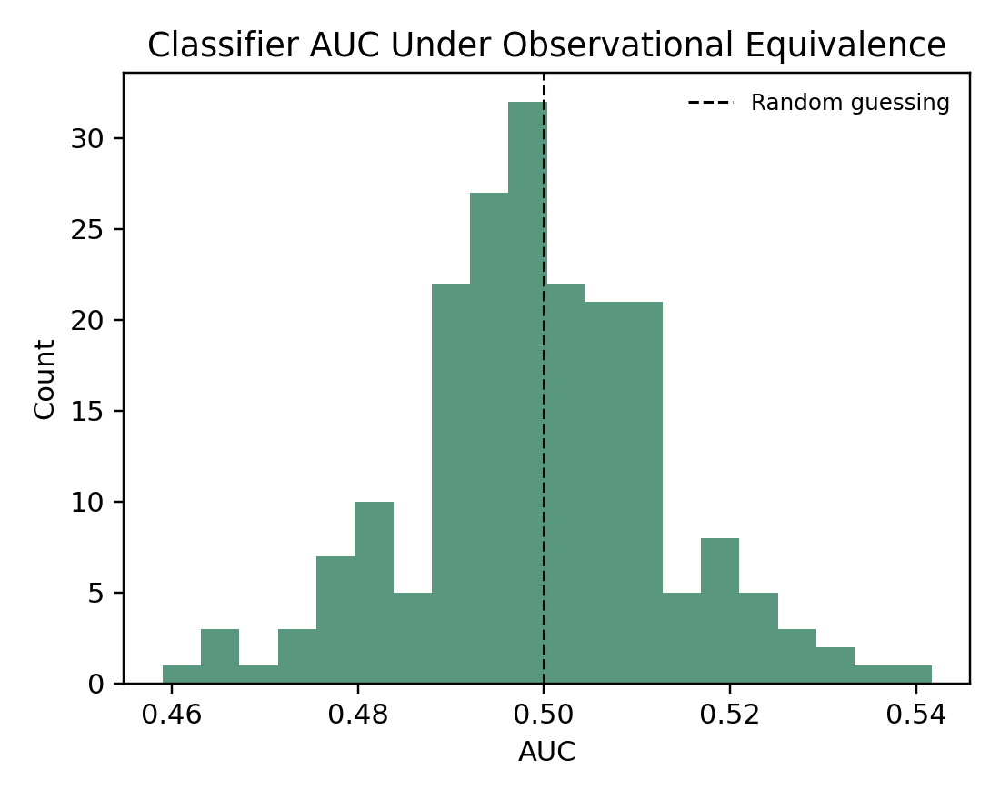

### 4.2 Restoration methods are conditional and failure-sensitive
**Evidence.** In well-specified regimes (`beta=0.8`), intervention and clean anchors are near-unbiased. Under measurement error and selection bias, errors increase sharply (for example, selection-on-readout naive RMSE 0.3694, do(X) RMSE 0.2889, anchor(0.0) RMSE 0.2274; Table 1, Figure 3).

| Scenario | Naive obs bias / RMSE | do(X) bias / RMSE | Anchor(0.0) bias / RMSE | Anchor(1.0) bias / RMSE |
|---|---:|---:|---:|---:|
| linear_gaussian | -0.1508 / 0.1511 | +0.0012 / 0.0156 | -0.0009 / 0.0142 | -0.1006 / 0.1013 |
| heavy_tail_noise | -0.1527 / 0.1535 | +0.0006 / 0.0143 | -0.0015 / 0.0149 | -0.1020 / 0.1031 |
| nonlinear_interaction | -0.1498 / 0.1507 | -0.0006 / 0.0168 | -0.0001 / 0.0179 | -0.0998 / 0.1011 |
| measurement_error_x | -0.2768 / 0.2770 | -0.2636 / 0.2639 | -0.2625 / 0.2628 | -0.2716 / 0.2718 |
| selection_on_readout | -0.3687 / 0.3694 | -0.2877 / 0.2889 | -0.2256 / 0.2274 | -0.3210 / 0.3220 |

**Inference.** Restoration tools work when their assumptions hold and can fail jointly when assumptions are violated.

**Hypothesis.** In single-cell workflows, proxy noise and selection (for example QC/filtering linked to readouts) are major pathways by which apparently causal estimates drift.

**Scientific implication.** Methods should be reported with assumption stress-tests, not only point performance in clean synthetic settings.

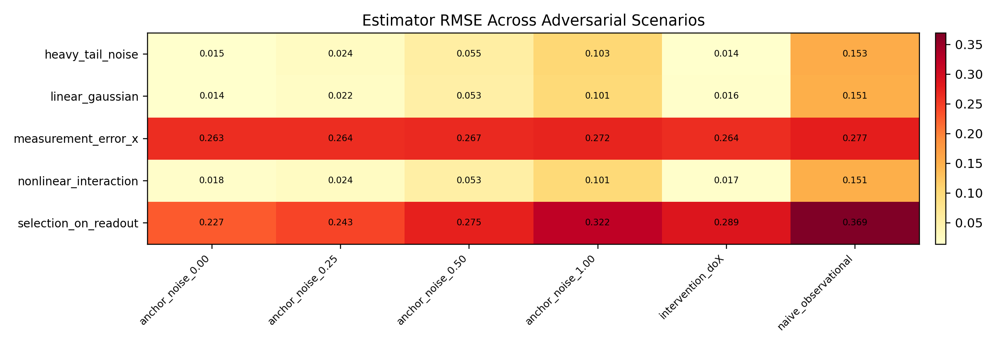

### 4.3 Anchor utility depends on confounding intensity
**Evidence.** Anchor adjustment outperforms naive estimates in 85.7% of confounded grid cells; mean improvement is slightly negative when `gamma=0` (-0.0024) and strongly positive at high confounding (`gamma=1.5`, +0.4030; Figure 4).

**Inference.** Anchors are most useful when confounding is strong and anchor quality is high.

**Hypothesis.** Heterogeneous tissues with strong latent programs benefit most from explicit state proxies; weakly confounded contexts may only inherit anchor noise.

**Scientific implication.** Anchor-based correction should be targeted to high-heterogeneity settings and accompanied by anchor quality diagnostics.

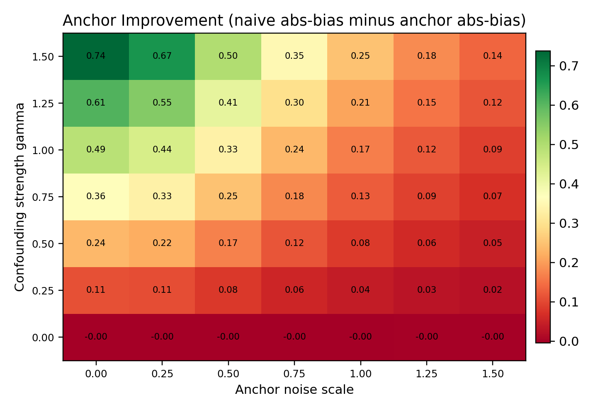

### 4.4 Environment-based identification has a sharp stability boundary
**Evidence.** Best-case condition (`alpha_shift=0`, variance ratio 1.8) yields RMSE gain +0.5147; weak-separation condition (variance ratio 1.0) yields severe degradation (RMSE gain -3.7109; Figure 5).

**Inference.** Environment invariance can be powerful, but only when environments provide meaningful variance separation while mechanism stability is preserved.

**Hypothesis.** Tissues that differ mostly by state mixture (not mechanism) support invariance recovery; tissues with mechanism drift violate assumptions and destabilize estimates.

**Scientific implication.** Environment selection is an experimental-design decision, not a passive metadata label.

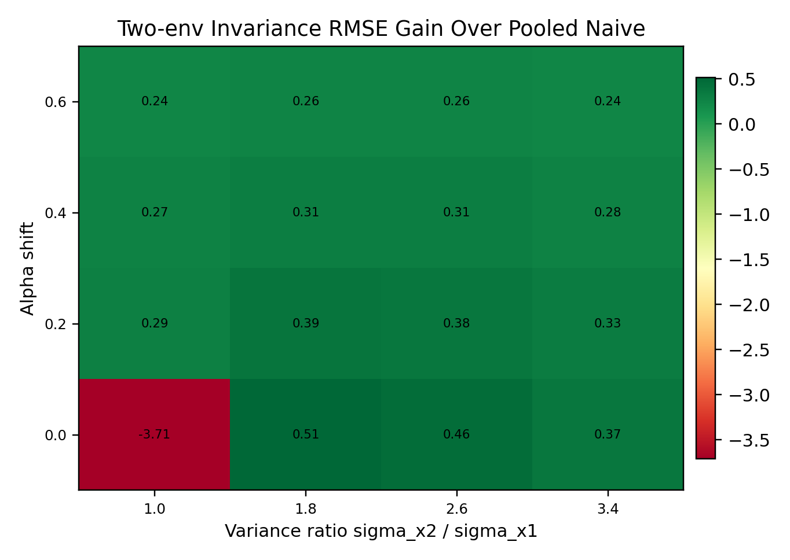

### 4.5 Cross-tissue diagnostics support directional plausibility for a minority of edges
**Evidence.** Of 76 evaluable edges, 22 pass conservative criteria (28.9%). Pass-set median `R^2` is 0.738 versus 0.130 for fail edges. Threshold-sensitivity, permutation null, and LOEO controls support non-random enrichment (observed 22 vs null mean 10.61; empirical p = 0.001996; pass LOEO median range 0.027 vs fail 0.144; Figures 6-10).

**Inference.** A robust pass subset exists, but most edges remain ambiguous under current identifiability diagnostics.

**Hypothesis.** The fail majority likely mixes true context-specific regulation, latent-state confounding, and measurement limitations.

**Scientific implication.** Current evidence supports triage: prioritize pass edges for mechanistic follow-up and treat fail edges as hypothesis-level associations.

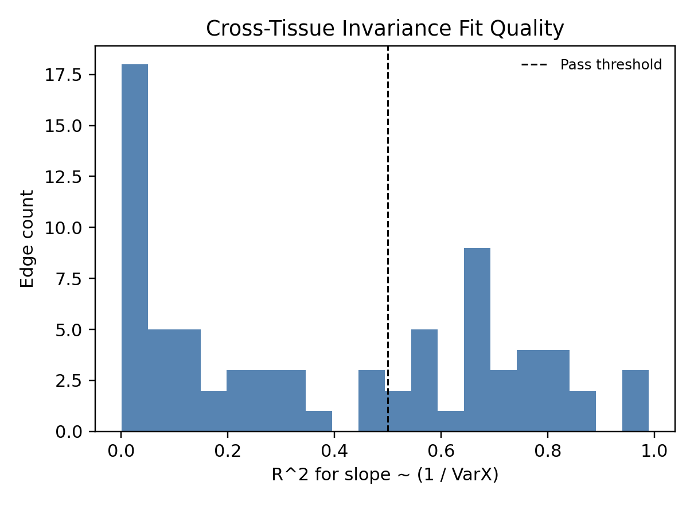
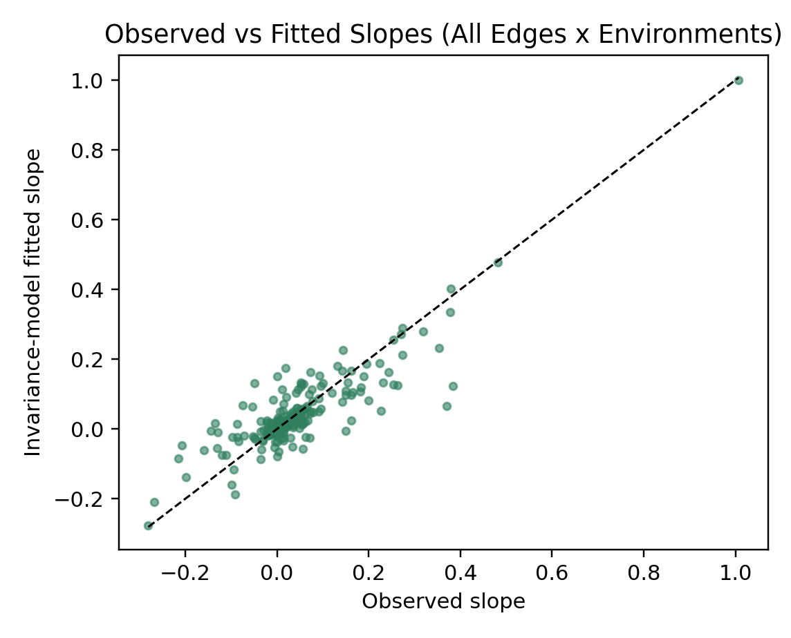
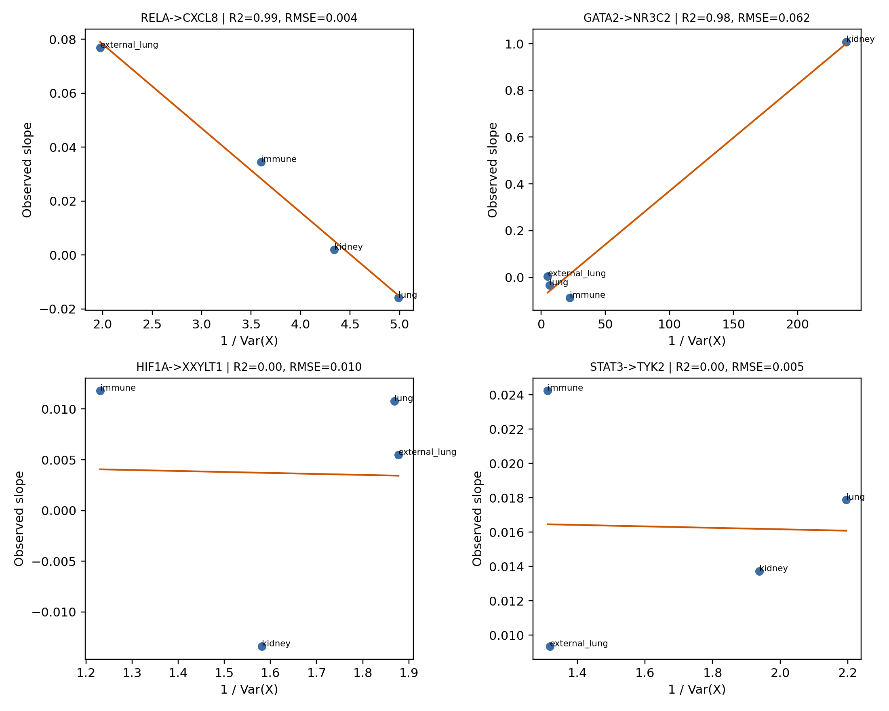
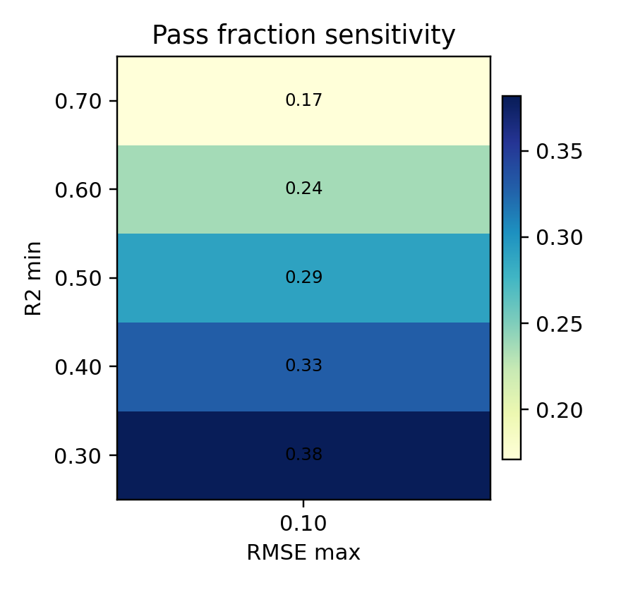
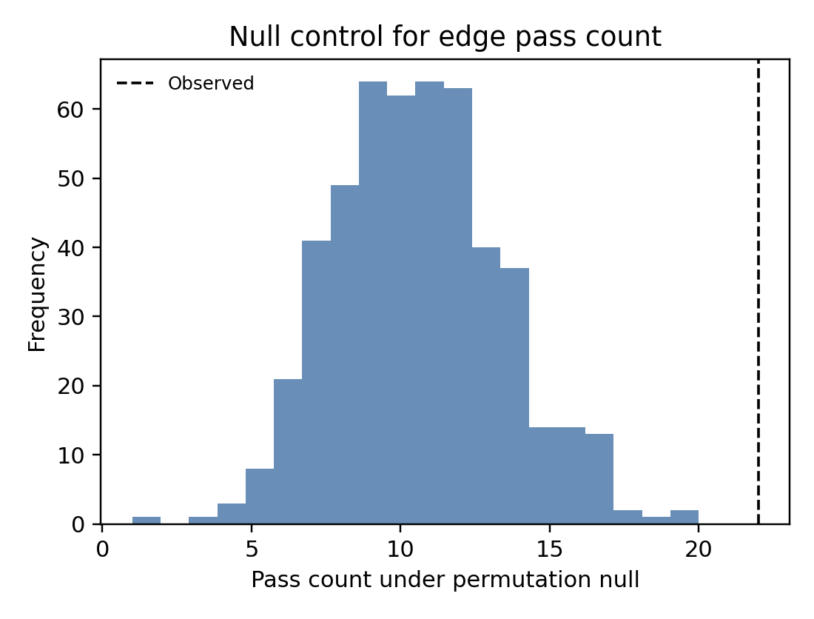

### 4.6 Targeted perturbation overlap adds direct but still limited causal grounding
**Evidence.** Direct perturbation overlap was available for 13 measurements across 7 unique edges (datasets: Adamson, Dixit, Dixit-7-day). Pass edges showed larger median absolute perturbation shift than fail edges (0.0152 vs 0.0063), but the difference was not significant (Mann-Whitney p = 0.217). Overall sign concordance between invariance beta and perturbation delta was 0.308 (Figure 11).

**Inference.** Perturbation-backed coverage now exists but is sparse and heterogeneous; it does not yet provide strong statistical separation between pass and fail subsets.

**Hypothesis.** Low sign concordance likely reflects intervention/context mismatch (CRISPR knockout response versus observational slope), timepoint effects, and limited overlap of paper edges with perturbation panels.

**Scientific implication.** Perturbation evidence should be incorporated as a confidence modifier, but larger targeted perturbation panels are still required before claiming broad causal confirmation.

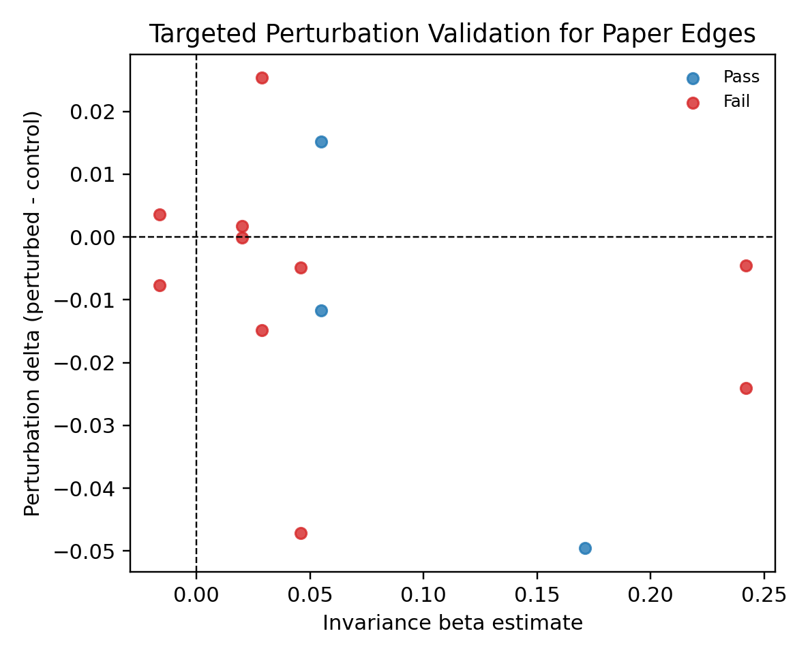

### 4.7 Pathway and cell-state analyses improve biological interpretability with modest pass/fail separation
**Evidence.** Hallmark enrichment identified 4 FDR-significant terms in pass targets and 4 in fail targets (FDR <= 0.1), but with different term profiles (pass: bile acid/xenobiotic/inflammatory-EMT signatures; fail: IL6-JAK-STAT3 and p53-related stress/proliferation signatures). GO BP showed many more significant terms for pass targets (256) than fail targets (36), consistent with denser ontology-connected functional neighborhoods in the pass set. Cell-state analysis yielded 1,902 state-level rows and 302 edge-environment summaries; pass edges had slightly higher median state sign consistency (0.75 vs 0.667) and lower median slope CV (2.00 vs 2.23), with non-significant separation (p = 0.671; Figures 12-13).

**Inference.** Biological coherence signals are present, but pass/fail separation is moderate and uncertainty remains substantial.

**Hypothesis.** Pass edges may preferentially occupy stable metabolic/inflammatory programs that are less state-fragile, while fail edges capture context-reactive programs with stronger condition dependence.

**Scientific implication.** Biological annotations can prioritize follow-up experiments, but they should not be treated as standalone causal proof.

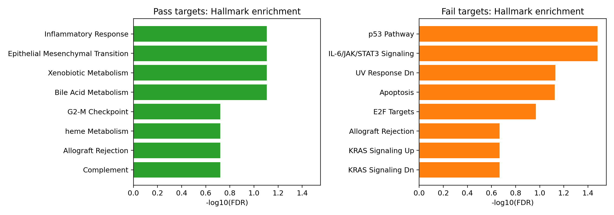
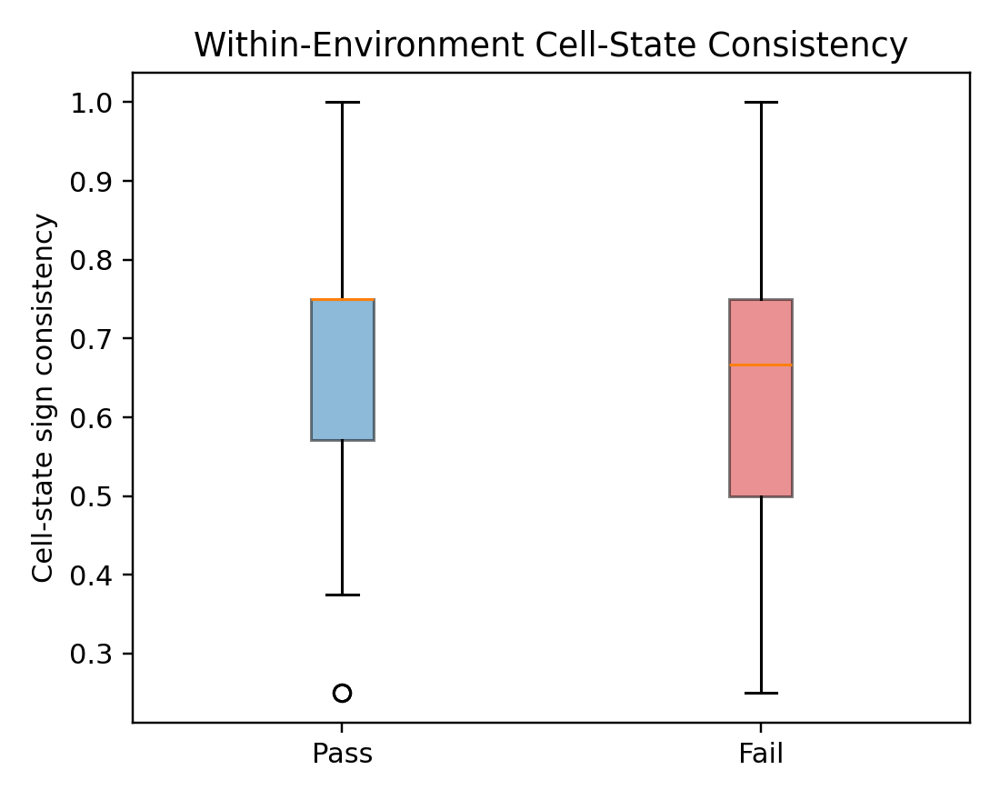

## 5. Biological Interpretation and Claim-Tier Protocol
For scientist-facing usage, we separate three claim tiers:

1. **Tier 1: context-associated edge.** Evidence: co-variation or internal signal only. Allowed language: "associated with" or "context-linked." Not sufficient for intervention design.
2. **Tier 2: directionally plausible edge.** Evidence: invariance diagnostics pass with falsification controls (null, sensitivity, LOEO). Allowed language: "directionally plausible under stated assumptions." Suitable for prioritization.
3. **Tier 3: perturbation-supported directional edge.** Evidence: Tier 2 plus aligned perturbation response in matched contexts. Allowed language: "supported directional effect in tested setting." Candidate for mechanistic intervention hypotheses.

This protocol prevents escalation from correlation-like internal structure to causal claims without aligned identification evidence.

## 6. Discussion
The main scientific result is not only a negative theorem. It is a practical calibration framework: when identifiability evidence is weak, constrain language and downstream decisions; when evidence strengthens across orthogonal checks, promote claims cautiously.

Gap-closure analyses improved this draft in two ways. First, they introduced direct perturbation grounding for a subset of edges, reducing reliance on purely observational diagnostics. Second, they added biological context through pathway and cell-state structure. Importantly, these additions did not justify over-claiming: perturbation overlap is still limited and pass/fail biological separation is moderate.

For computational biologists, the operational lesson is to treat mechanistic interpretability as a staged evidence program. The right question is not "does this edge look mechanistic," but "which evidence tier does this edge satisfy, and what scientific decision is justified at that tier?"

## 7. Limitations
1. Synthetic analyses are intentionally low-dimensional and cannot capture the full nonlinear, multi-layer regulation of real tissues.
2. Direct perturbation overlap is still sparse (7/76 edges), so most real-data edges remain supported primarily by observational-plus-invariance diagnostics.
3. Enrichment analyses are sensitive to ontology redundancy and background definitions; pathway significance is supportive, not causal.
4. Cell-state consistency differences between pass and fail are directionally favorable but statistically weak in the current sample.
5. External reproducibility quality still depends on keeping the public repository synchronized with manuscript revisions.

## 8. Conclusion
Directional mechanistic claims from observational internals are generally non-identifiable under latent cell-state confounding. Interventions, high-quality anchors, and validated environment structure can restore directional identification under explicit assumptions, but adversarial failures are common in biologically realistic regimes. In current tissue data, a minority of edges pass conservative directional plausibility diagnostics, and only a subset currently has direct perturbation overlap. The scientifically defensible path is therefore evidence-calibrated claim language and targeted experimental follow-up.

## 9. Data and Code Availability
All analysis code, figure-generation scripts, configuration files, and manuscript assets are available at:

[https://github.com/Biodyn-AI/latent-cell-state-identifiability](https://github.com/Biodyn-AI/latent-cell-state-identifiability)

The repository includes one-command reproduction entrypoints for the main figures/tables and dataset access notes.

## 10. References
[1] Cui, H., Wang, C., Maan, H., Pang, K., Luo, F., Duan, N., and Wang, B. (2024). scGPT: toward building a foundation model for single-cell multi-omics using generative AI. Nature Methods.

[2] Theodoris, C. V., Xiao, C., Chopra, A., Chaffin, M. D., Sayed, Z., Hill, M. C., Mantineo, H., et al. (2023). Transfer learning enables predictions in network biology. Nature, 618, 616-624.

[3] Hicks, S. C., Townes, F. W., Teng, M., and Irizarry, R. A. (2018). Missing data and technical variability in single-cell RNA-sequencing experiments. Biostatistics, 19(4), 562-578.

[4] Luecken, M. D., and Theis, F. J. (2019). Current best practices in single-cell RNA-seq analysis: a tutorial. Molecular Systems Biology, 15(6), e8746.

[5] Geiger, A., Lu, H., Icard, T., and Potts, C. (2021). Causal abstractions of neural networks. NeurIPS.

[6] Meng, K., Bau, D., Andonian, A., and Belinkov, Y. (2022). Locating and editing factual associations in GPT. NeurIPS.

[7] Jain, S., and Wallace, B. C. (2019). Attention is not explanation. NAACL-HLT.

[8] Hewitt, J., and Liang, P. (2019). Designing and interpreting probes with control tasks. EMNLP-IJCNLP.

[9] Adebayo, J., Gilmer, J., Muelly, M., Goodfellow, I., Hardt, M., and Kim, B. (2018). Sanity checks for saliency maps. NeurIPS.

[10] Belinkov, Y. (2022). Probing classifiers: Promises, shortcomings, and advances. Computational Linguistics, 48(1), 207-219.

[11] Pearl, J. (2009). Causality: Models, reasoning, and inference (2nd ed.). Cambridge University Press.

[12] Peters, J., Janzing, D., and Scholkopf, B. (2017). Elements of causal inference: Foundations and learning algorithms. MIT Press.

[13] Alain, G., and Bengio, Y. (2016). Understanding intermediate layers using linear classifier probes. ICLR Workshop.

[14] Olsson, C., Elhage, N., Nanda, N., Joseph, N., DasSarma, N., Henighan, T., Mann, B., Askell, A., Bai, Y., et al. (2022). In-context learning and induction heads. arXiv:2209.11895.
